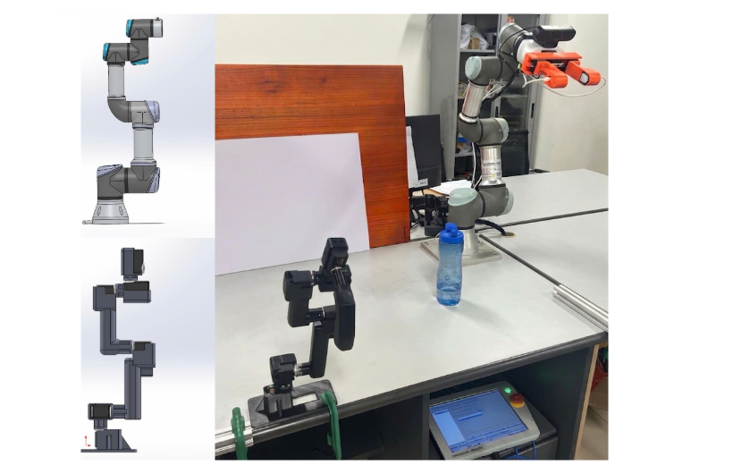

# Leader-arm-to-teleop-for-Ur3


Teleoperation framework for **UR3 robot arm** using a **Feetech-based leader arm**, supporting both **real hardware control** and **MuJoCo simulation** for development and testing.

## Real Hardware Setup

<p align="center">
  
</p>
<p align="center">
  <em>Real-world teleoperation setup with custom leader arm and UR3 follower robot</em>
</p>

---

## Overview

This project is developed for **master-follower teleoperation** between a custom leader arm and a **Universal Robots UR3**.

The system is designed to support:

- **real-time teleoperation of UR3**
- **leader-follower joint mapping**
- **simulation with MuJoCo**
- **future extension with vision and perception modules**

```text
System Goal:
  leader arm motion capture
  + UR3 follower control
  + simulation and real hardware support
  + extensible teleoperation framework
```

---

## Quick Start

```bash
colcon build --symlink-install
source install/setup.bash
ros2 run my_ur_teleop mujoco_sim
```

For full teleoperation, launch the leader arm node and the UR3 follower node in separate terminals.

---

## Hardware Overview

The teleoperation hardware includes a **custom leader arm** built for motion input and a **UR3 robot** as the follower.

Main hardware components:

- **UR3 collaborative robot arm**
- **Feetech STS3215 servo motors** for the leader arm
- Mechanical parts for the leader arm assembly
- 3D printable structural parts stored in the `hardware/` directory

The repository also includes **STL files for 3D-printed hardware components**, which can be used for fabrication, assembly, and further mechanical development of the leader arm system.

```text
Hardware:
  - UR3 follower robot
  - Feetech STS3215 servo-based leader arm
  - 3D printed mechanical parts
  - STL design files in hardware/
```

---

## Core Focus

The main focus of this project includes:

- **UR3 teleoperation**
- **Leader arm motion capture**
- **Master-follower control**
- **Real / simulation dual-mode workflow**
- Future extension with **vision-based support**

---

## System Functions

### UR3 Follower Control

The UR3 side is responsible for receiving the leader arm motion and executing follower movement.

Main functions:

- Joint-space follower control
- Real-time teleoperation command execution
- RTDE-based communication for real UR3
- Simulation-side follower support in MuJoCo

### Leader Arm Control

The leader arm is used as the input device for the operator.

Main functions:

- Joint state reading from Feetech actuators
- Motion publishing for teleoperation
- Mapping of operator motion to follower robot
- Real hardware and simulated leader modes

### Simulation and Support Modules

The project also supports development tools around the teleoperation pipeline.

Main components:

- MuJoCo simulation node
- Calibration utilities
- Vision-related modules
- Testing workflow for safe development before real deployment

---

## Typical Workflow

A basic teleoperation sequence in this project is shown below:

```text
1. Start leader arm node
2. Start UR3 follower node
3. Read leader arm joint motion
4. Map leader motion to UR3 commands
5. Execute follower movement
6. Monitor system response
7. Continue teleoperation in real or simulated mode
```

---

## Control Pipeline

The overall control structure can be summarized as:

```text
Operator Motion
      |
      v
 Leader Arm Joint Capture
      |
      v
 Motion Mapping / Teleop Logic
      |
      v
   UR3 Follower Control
      |
      v
 Real Robot or MuJoCo Simulation
```

This modular design makes the system easier to test, modify, and extend.

---

## Project Structure

A simplified project structure is shown below:

```bash
teleop-ur3/
├── src/
│   └── my_ur_teleop/
│       ├── my_ur_teleop/
│       │   ├── ur3_subscriber.py
│       │   ├── feetech_publisher.py
│       │   ├── feetech_publisher_sim.py
│       │   ├── mujoco_sim_node.py
│       │   ├── mujoco_subscriber_sim.py
│       │   ├── vision_motion_node.py
│       │   ├── cv_detection_node.py
│       │   ├── matrix_5x5_mujoco.py
│       │   └── hardware/
│       ├── models/
│       ├── package.xml
│       └── setup.py
└── README.md
```

---

## Key Features

```text
- UR3 teleoperation framework
- Feetech-based leader arm control
- STS3215 servo hardware integration
- MuJoCo simulation support
- Expandable architecture for vision and calibration modules
```

Main strengths of this repository:

- Supports both real and simulated workflows
- Provides a compact base for UR3 teleoperation research
- Includes hardware-related resources for leader arm development
- Easy to extend for perception and advanced control experiments

---

## Applications

This framework can be used in tasks such as:

- Leader-follower robot teleoperation
- UR3 remote manipulation
- Safe testing in simulation before real deployment
- Human-in-the-loop robot control research
- Development of custom teleoperation interfaces

---

## Future Work

Planned extensions may include:

```text
- Improved calibration pipeline
- Better motion mapping between leader and follower
- Vision-based assistance
- Haptic or force feedback integration
- ROS 2 workflow refinement
- Extended hardware development for the leader arm
```

---

## Notes

This repository is designed as a base for combining:

- **custom leader arm hardware**
- **Feetech STS3215 actuation**
- **UR3 teleoperation**
- **simulation-first development workflow**

It can be used as a practical starting point for building a more complete teleoperation system for UR robots.
